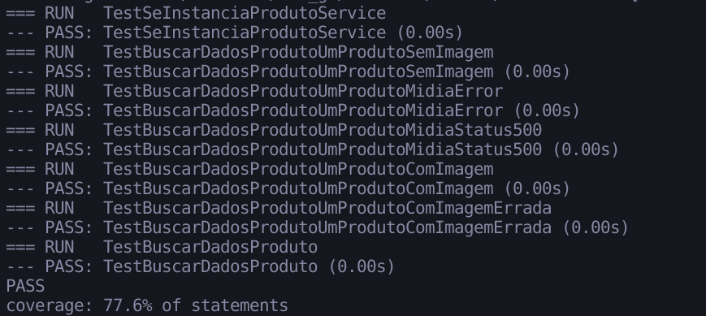

# BFF Go

Esse é uma POC (Proof Of Concept) de um BFF (Backend For Frontend) em GO. Ele implementa o conceito e pastas do "DDD" seguindo tanto visualmente quanto funcionalmente os mesmos conceitos. Por se tratar de um BFF ele não necessita de Agregados e Entidades, apenas de services e interfaces.

A linguagem `go` possui algumas estruturas recomendadas e especificas da própria linguagem como a pasta `cmd` e `internal`.

-   A pasta `cmd` é onde fica o agrupamento dos arquivos de entrada da aplicação (equivalente ao `main.js` no NestJS/Node.js)
-   A pasta `internal` é equivalente a pasta `src`.

```text
cmd/
├─ bff/
internal/
├─ controller/
├─ domain/
│  ├─ service/
infra/
├─ service/
shared/
├─ middleware/
```

No momento, a implementação da aplicação se resume a apenas a interface `ProdutoService` implementando o método `BuscarDadosProduto` que retorna um response `BuscarDadosProdutoResponse` mesclando e unificando os retornos de `midia` e `preco`:

```json
{
    "data": [
        {
            "sku": "1515",
            "preco": 10.0,
            "imagens": [
                {
                    "url": "http://teste.com.br",
                    "principal": true,
                    "ordem": 1
                }
            ]
        }
    ]
}
```

## Como utilizar

Foi feito utilizando a versão `1.21.3`

Como no momento a aplicação é apenas uma POC, a funcionalidade está sendo testada no arquivo `produto_test`. Ele testa a implementação e o agrupamento dos dados dos serviços `midia` e `preco` em vários casos de uso.

Para executar:

```bash

# Executar test
$ make test

```


